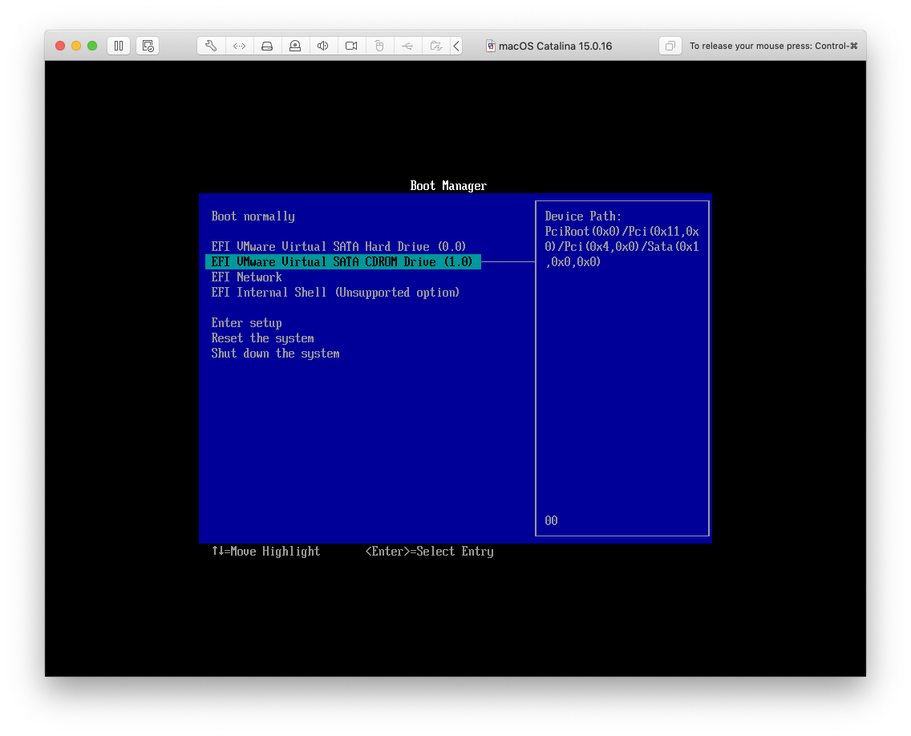

# Create a MacOS Catalina ISO

#### Introduction

Create an ISO of MacOS Catalina which can then be used to create a VM using VMware Fusion for Mac.

#### Create the ISO Image

1. Download and save the attached .sh file to your Mac.
2. Open the Terminal at that folder and run the below command.

```bash
$ ./MacOS-Catalina-ISO.sh
```

3. To view the .iso file, run the following command.

```bash
$ open ~/Desktop
```

#### Running the ISO with VMware Fusion/Workstation

Running macOS Catalina in VMware requires a few configuration changes to get it running. 

1. Create the VM initially with a Guest OS of **macOS 10.14**.

2. Before running the VM, click on the option to **configure the settings** and change the **RAM to 4GB**.

3. Next click on the **System Setting - General**. In here change the Guest OS to **Windows 10 x64** and click **change** to accept the changes.
   
   

4. Run the VM. 
   
   You will get a 'Boot failed' message. Don't worry! 
   
   Just let it run until the BIOS Boot Manager appears.

5. In the Boot Manager, select **EFI VMware Virtual SATA CDROM Drive (1.0)** and press **Enter**.
   
   

6. The VM should now run without issues and load the MacOS Utilites wizard. Follow the steps to start the installation process.
   
   Eventually the "real" installation screen will pop up. You've got about 15 minutes, so go grab a coffee, feed the fish or play with the [cat](https://chrome.google.com/webstore/detail/tabby-cat/mefhakmgclhhfbdadeojlkbllmecialg?hl=en).

7. Eventually the MacOS Utilities wizard will appear again. Select the Apple logo in the top left and **Shutdown the VM**.

8. Go back into the **VM settings** and change the Guest OS back to **macOS 10.14**. Click **change** to accept the changes, **boot the VM** again and you're done!
